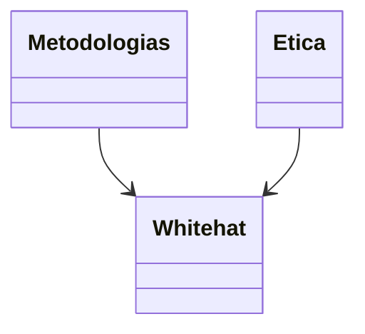

---

# Importancia del hacking ético.

El hacking ético no solo trata de ayudar y prevenir riesgos, brechas de seguridad además de reforzar la confianza sobre los propios clientes y sus socios del rubro.
Es importante demostrar un compromiso hacia las agencias para ayudarles con la protección sobre sus datos. Lo importante en la práctica es demostrar lo evidente al considerar las amenazas potenciales de los ataques.

Se debe actuar con integridad y responsabilidad para evitar cualquier conducta que lleve a causar daños y romper las leyes vigentes.

Se debe tener en cuenta de que tiene vulnerabilidades ser  un hacking ético. Lleva tanto ventajas como sus limitantes, si puede mejorar con el tiempo la seguridad de la información nunca garantizara las detecciones de todas las debilidades.

---

---
### Diferencias entre White hats y Black Hats.

Existe una diferencia en la cuestión de legalidad sobre los Hackers no éticos y los éticos.

Los éticos (White hat) buscan ayudar a las empresas y reforzar sus seguridades para evitar filtraciones, robos de información y financieras.
Su manera de ayudarlos es a través de brindarles sus servicios para probar sus seguridades y que tan seguros son. Además de que buscan a ciberdelincuentes.

Los no éticos (Black Hat). Buscan su propio beneficio o son contratados a través de un cliente externo para filtrar y robar información importante de empresas para venderlas.
además busca explotar debilidades.

Existe un 3° tipo llamado Grey Hat.
Operan en una zona gris de la legalidad. Se les permite abordar de manera más eficiente ciertas amenazas cibernéticas además de implementar estrategias de defensa para cada tipo de ataque.

---
---
### Importancia sobre el hacking ético para las organizaciones.

El hacking ético permite realizar evaluación a los niveles de seguridad vigentes al momento de realizar un análisis, identificación de vulnerabilidades y corregirlas al momento para evitar amenazas.
Provee una seguridad crucial y requerida para la implementación de procedimientos de manera periódica para las evaluaciones de vulnerabilidad.

En la actualidad los ataques en línea  electrónicos ya solo son más frecuentes sino que van siendo más sofisticadas. Obligando a mantenerse en un constante bucle de actualizaciones en temas de seguridad y probar que tan eficiente son los controles realizando revisiones y correcciones.
Sobre el sector financiero es un objetivo preferido para los delincuentes. En esto la seguridad no debe de descuidarse en ningún momento, el más mínimo error puede llevar a una pérdida de la reputación de la entidad misma. 

La práctica del hacking ético se vuelve fundamental en un contexto actual donde la creciente dependencia de las organizaciones en las tecnologías de la informática. En diferencia al Hacking no ético. El ético busca  identificar y resolver vulnerabilidades en distintos sistemas antes que sean explotadas por actores malintencionados.

Se busca el cumplimiento de la normativa  y sus estándares de seguridad. En muchas otras industrias específicamente aquellas que se manejan información sensible como sería el sector financiero o la de salud. estás deben de cumplir con una rigurosas regulaciones de la seguridad.
Se debe de mostrar un compromiso proactivo con la seguridad para diferenciar a una empresa de sus competidores. Se debe proteger información de gobiernos, empresas y otras organizaciones. Para así la permisión de operar y alcanzar sus metas. Así han surgido los “hackers éticos”.

Existe un artículo que permite resaltar la importancia de la existencia del hacking ético para las empresas al mismo tiempo dirigido a las comunidades académicas como al público mismo. Demostrando su papel esencial para la sociedad protegiendo los datos del gobierno y las organizaciones que buscan ayudar a identificar y resolver vulnerabilidades para prevenir futuros ciberataques.

---
### La ética y sus ciberdelitos.

Trata de explicar los artículos que representan un análisis sobre el aporte al conocimiento de la sociedad.
Se propone analizar las causas y sus efectos de la sobreexposición de los adolescentes y los ciberdelitos y la conceptualización de los delitos informáticos. Estos estudios previos han omitido una comprensión fundamental sobre este mismo problema afectando especialmente a la juventud.

Se realizó una investigación sobre los delitos y donde se enfocan las vulnerabilidades de los adolescentes. Esa investigación se tituló “Sobreexposición de los adolescentes en ciberdelitos en el ecuador”.
Se debió a la falta del control y la supervisión por parte del padre o tutor legal sobre el adolecente.

En este trabajo se basa sobre una investigación crítica donde se basa en teorías éticas y teorías donde la tecnologías cuyo objetivo se analiza en coincidencias y sus diferencias encontradas en los estudios previos.
Se abordó la victimización y la vulnerabilidad en los adolescentes asi podria ser una reseña de los ciberdelitos del ecuador.

Se revisan problemas éticos donde se relaciona con el uso de las tecnologías de la información y su comunicación.
La mayoría de los comportamientos delictivos no tienen una amplitud suficiente donde no obstante su investigación proporciona un análisis detallado en una amplia variedad de eventos de la ciberdelincuencia.

La ciberseguridad es un grupo de trabajo llamado Joint Task Force que demuestra una disciplina formativa que integra la tecnología, personas, información y procesos que busca garantizar operaciones seguras frente a adversarios. Esta misma disciplina busca abarcar la creación en operaciones, análisis y pruebas de sistemas informáticos.

En su esencia actúa ante potenciales amenazas cibernéticas de forma sofisticada y de forma frecuente para la ciberseguridad en un estudio interdisciplinario que busca incluir algunos aspectos de derecho, política y factores humanos.
Busca comprender las implicaciones legales y éticas en las acciones en un ciberespacio para la manera de que se afronta la política de seguridad se puede influir en forma de protección de la información y la privacidad del usuario.
Se proporciona una visión más específica sobre dichos temas con relación a la seguridad de información así destacando su importancia en la defensa de datos sensibles para individuos o organizaciones.

---

### Limitantes. (Page 19)

En la identificación de vulnerabilidades sobre la seguridad en los sistemas y redes ante los hackers, se debe de buscar pruebas donde suelene centrarse únicamente en isstemas operativos en la configuraciones de seguridad y errores tecnicos en lo que se limita su alcance en un diagnostico tecnico basico de seguridad.
El factor del tiempo juega un papel crucial en las pruebas. donde los hacker maliciosos tienen una ventana de tiempo y paciencia para encontra vulnerabilidades donde mientras que las empresas suelen contratar a terceros para la realización de pruebas lo que implica costos y su necesidad de acelerar los procesos de porporcionamiento de informacion privliegiada.
Esto logra limitar las oportunidades de descubrir las vulnerabilidades ya que las pruebas se basan en la informacion proporcionada. Es otral imitacion significativa en que las pruebas generalmente se trata de enfocar a amenazas externas.
Se menciona que en un sistema desde dentro no se puede asegurar completamente en su seguridad que solo con pruebas externas se evalúan.

---
---

# 1° Diagrama.

---
